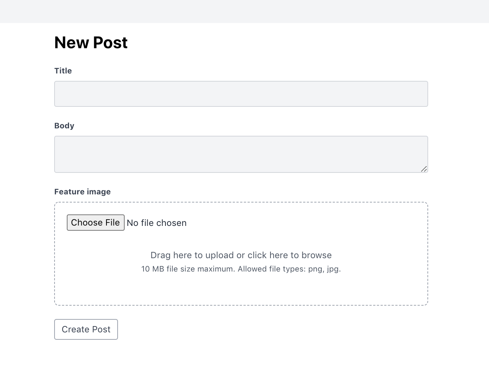
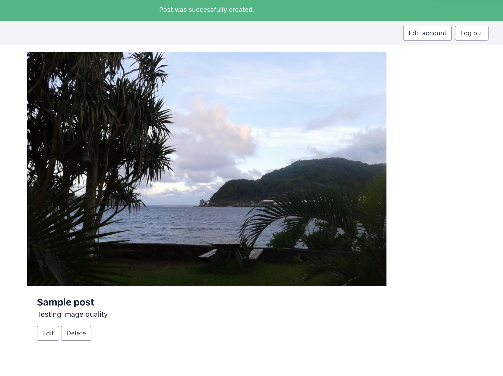

# active storage-stimulus-dropzone

This rails project is just a basic blog post to practice implementing a drag and drop feature. This one uses Active Storage, StimulusJS and DropzoneJS. 

 

It was built following a [tutorial](https://www.youtube.com/watch?v=fg_8qJ-su6A) by [Andy Leverenz](https://web-crunch.com​)

